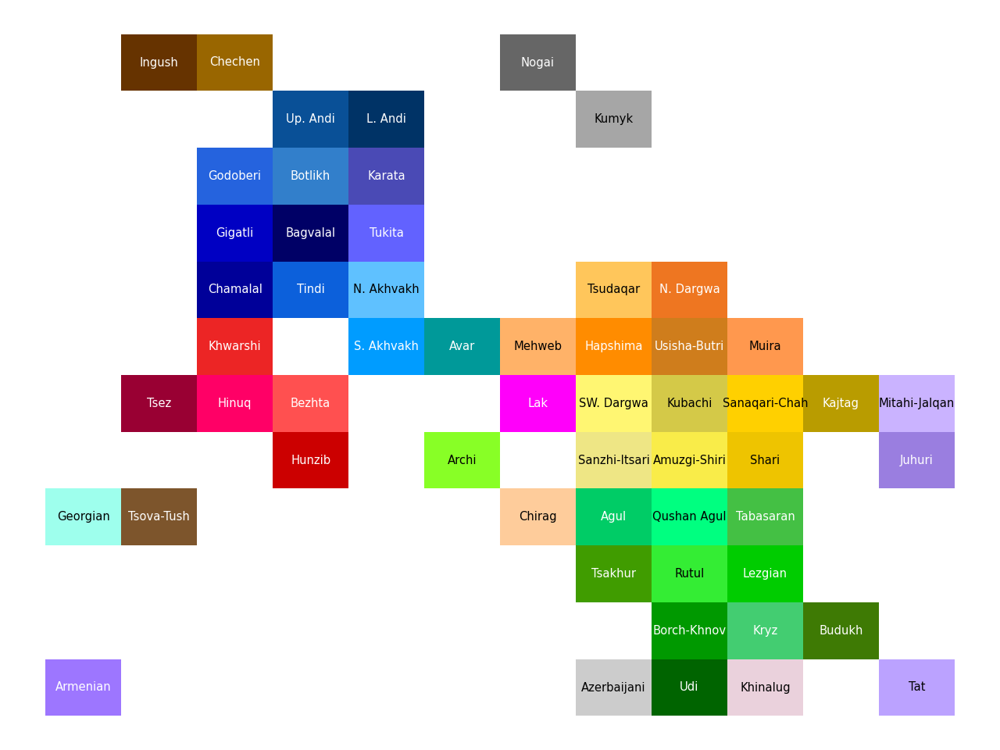
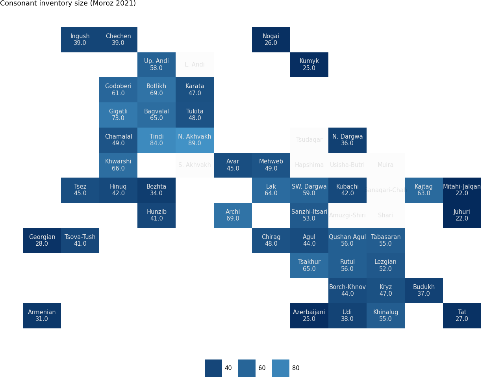

# PyCaucTile

[](https://pypi.org/project/PyCaucTile/)
[](https://pypi.org/project/PyCaucTile/)
[](https://pypi.org/project/PyCaucTile/)

A package that generates tile grid maps for illustrating features of East Caucasian languages. The plots are created using `plotnine` library, providing a ggplot2-like interface in Python. 

This software was created as a part of the project of the Linguistic Convergence laboratory. There is also an R package that shares the same functionality (see [`RCaucTile`](https://github.com/LingConLab/RCaucTile)) by George Moroz.

## Installation
```bash
pip install pycauctile
```

## Example usage
```python
from pycauctile import ec_tile_map, ec_languages

map = ec_tile_map()
map
```


```python
map = ec_tile_map(ec_languages,
            feature_column = "consonant_inventory_size",
            title = "Consonant inventory size (Moroz 2021)",
            annotate_feature = True)
map
```


## Citation
If you use this software, please cite it as below.
```
Termus, V. (2025). PyCaucTile: a package for generating tile grid maps of East Caucasian Languages (Version 1.0.0) [Computer software]. https://github.com/LingConLab/PyCaucTile
```

```
@software{Termus_PyCaucTile_a_package_2025,
author = {Termus, Vladislava},
month = sep,
title = {{PyCaucTile: a package for generating tile grid maps of East Caucasian Languages}},
url = {https://github.com/LingConLab/PyCaucTile},
version = {1.0.0},
year = {2025}
}
```